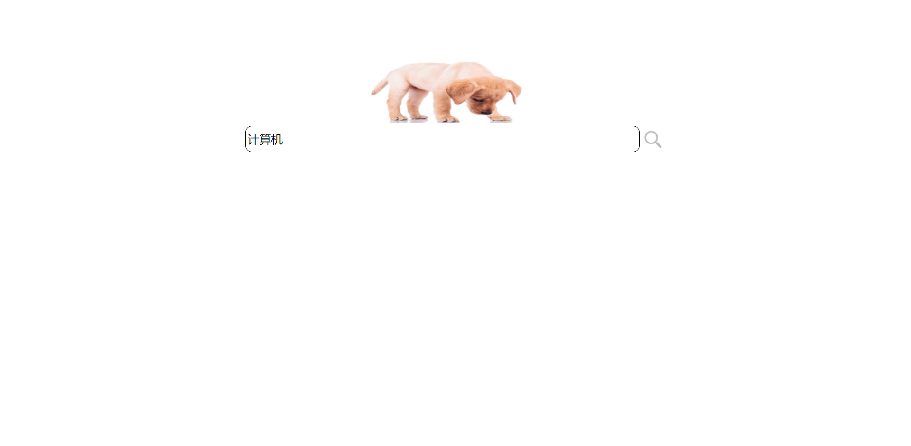
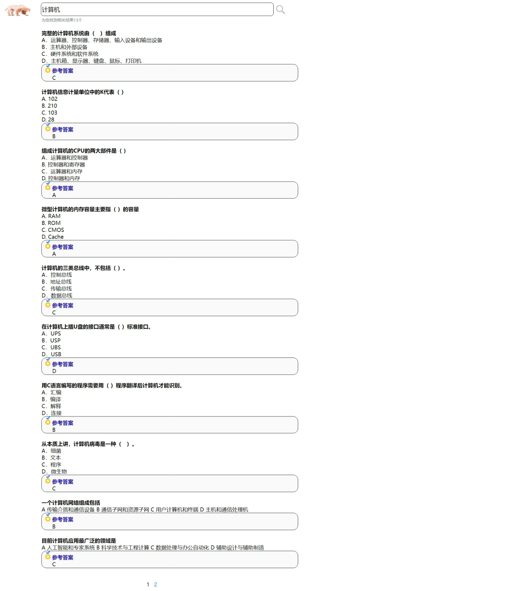

# 项目介绍

小狗嗅题是一个搜题网站,项目采用 SpringBoot+Thymeleaf 开发

## 项目技术栈

### 后端技术栈

1.Spring Boot
2.MyBatis
3.MySQL

### 前端技术栈

1.HTML
2.CSS
3.JavaScript

## 项目效果图

网站体验地址:http://81.70.93.5(因题库较小,请搜题时输入"计算机")

## 主要功能

题目搜索,分页显示,选项切割(实现每个选项换行显示),字符串过滤,访问日志记录

## Linux服务器部署方法

前置要求:Linux上已经安装Java,MySQL

1.修改application.properties中的mysql配置

2.在MySQL中导入import.sql
3.打包,生成文件SearchQuestion-0.0.1-SNAPSHOT.jar
4.在Linux上执行nohup java -jar xuexiaoyi-0.0.1.jar
5.访问网站(默认端口80)
